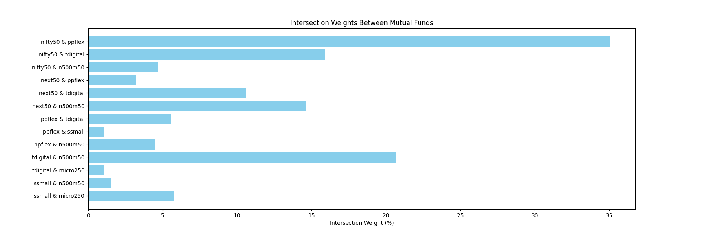
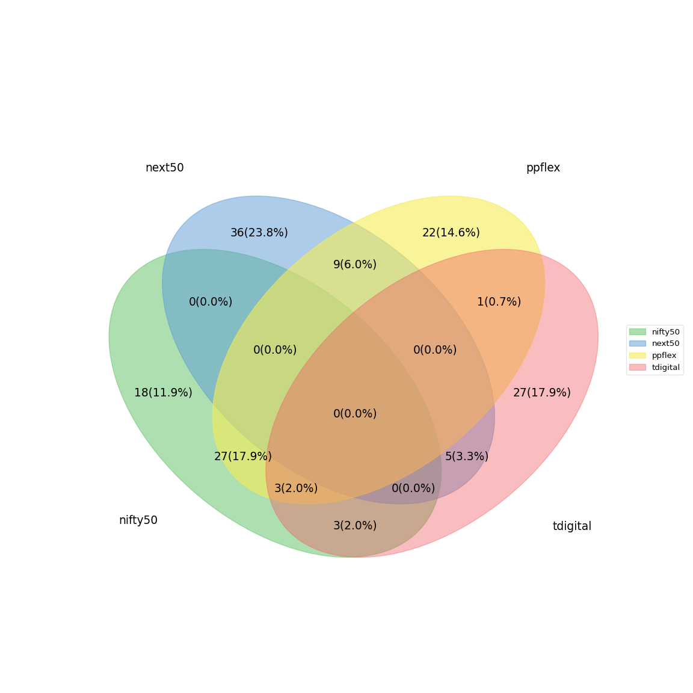
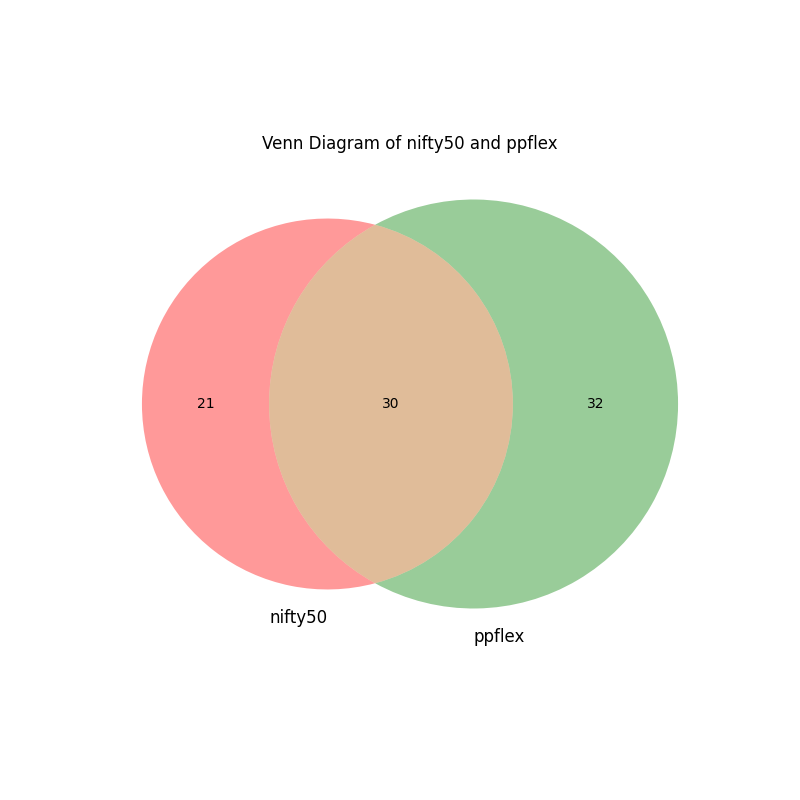

# Mutual Fund Analysis

This repository provides tools for analyzing and visualizing intersections between mutual fund holdings using CSV data. It processes holdings data to compute intersections and generates visualizations like bar charts and Venn diagrams.

## Visualizations

### Intersection Weights

The bar chart below illustrates the intersection weights between various mutual funds.

### Venn Diagram

The Venn diagram below shows the intersections between four mutual funds: nifty50, next50, ppflex, and tdigital.

There are also 2-way Venn diagrams for all pairs.

